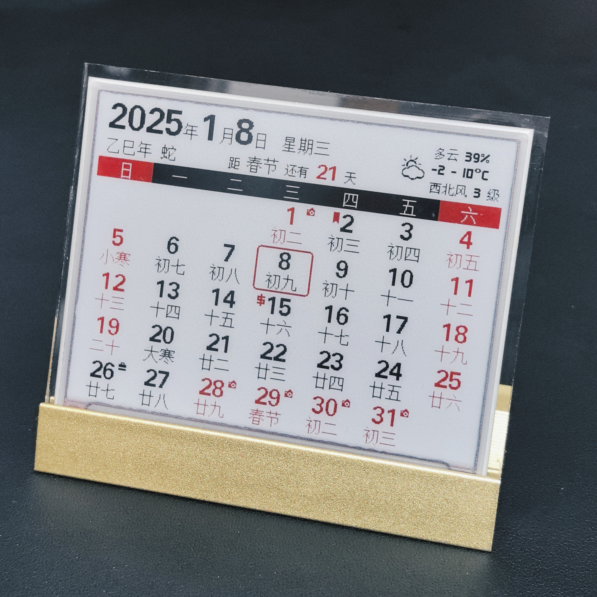
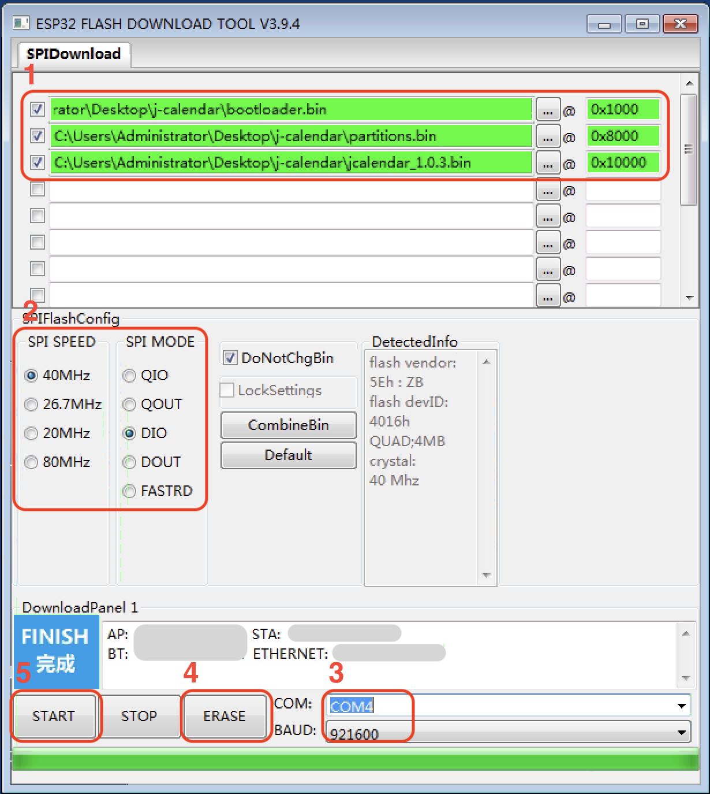

# J-Calendar
墨水屏日历，采用三色4.2寸墨水屏，展示基本月历信息，支持农历、公共假期、倒计日、天气（实时天气、每日天气）展示。 
项目以低难度、低成本的方式，方便爱好者实现属于自己的低功耗月历。 
 
Bilibili连接：https://www.bilibili.com/video/BV1wHDhYoE3G/ 
注：固件仅供个人下载免费使用，禁止商用。

## Prepare & Meterial
1. esp32开发板(建议lolin32 lite,其他esp32开发板亦可) 
2. 4.2寸三色墨水屏(400*300)。
3. 通用墨水屏驱动板。
4. 锂电池,需要做ph2.0接头。(建议603048, 900mah)
5. 金属底座亚克力台卡,95*80mm。
6. 轻触开关,(12\*12\*7.3,带键帽)
7. 工具:电烙铁、电线若干。

## Manufacture Guide:
1. 开发板接线 
    * 墨水屏驱动板
        * Busy->4
        * RST->16
        * DC->17
        * CS->5
        * SCK->18
        * SDA->23
        * GND->GND
        * VCC->3V
    * 其他
        * 按钮->(PIN_14, GND)
        * LED->22(板载)
2. 三色墨水屏排线插入时注意针脚方向,屏幕排线和驱动板排线1号针脚均是悬空,注意对齐。
3. 电池接口需要是ph2.0,且注意正负极(开发板上有标注),如果电池的正负极反了,可以用镊子调整电池插头。
4. 烧录固件 
    使用ESP32的烧录工具flash_download_tool烧录固件. [Flash Download Tools](https://www.espressif.com/en/support/download/other-tools?keys=flash+download+tools)
    1. 选择烧录的文件和烧录地址（bootloader.bin与partitions.bin烧录过一次后，就不需要重复烧录了）
    2. 选择Flash的配置信息
    3. 选择连接的串口以及波特率（波特率可以根据实际情况调整）
    4. 擦除Flash。
    5. 开始烧录。 
    注：文件前面一定要打勾，否则不会刷进flash的！！！ 
    （参考下图） 
    
5. 安装盒，3D打印，用PLA或ABS均可。[E-ink box2 v22.3mf](./assets/file/E-ink%20box2%20v22.3mf)

## Button Operation Guide:
1. **单点**  
    如果处在休眠中,唤醒系统,并强制刷新月历。
    如果处在运行中,强制刷新日历。
    如果处在配置中,不做任何处理。
2. **双击**  
    系统正常运行中,双击进入系统配置。(并强制停止WIFI相关操作,如获取天气。)
    系统配置状态中,双击重启系统。
3. **长按**  
    系统运行中,长按清除配置信息(WIFI密钥除外)和缓存,并重启。

## LED Indicator: 
(板载LED,PIN-22)
1. 快闪: LED每秒闪约两次，系统启动中(正在连接WIFI)
2. 常亮: WIFI连接完成。
3. 慢闪: LED每两秒闪一次，WIFI连接失败（10秒钟后休眠）。
4. 三短闪一长灭: 系统配置中。（3分钟后超时休眠）
5. 熄灭: 系统休眠。

## Web Config Guide:
通过在开机状态下(LED常亮)双击,即可进入配置状态,这时系统会生成一个名为J-Calendar的ap,默认密码为:password。(默认超时时间为180秒)
连接上ap后会直接弹出配置页面。(或者直接通过浏览器输入地址 http://192.168.4.1进入)。
配置页面:
1. Config Wifi. Wifi配置  
    进入配置wifi页面,选择搜索到的ap,并输入密码,并保存。
2. Setup. 系统配置  
    * 周首日:
        * 0: 周日(默认); 1: 周一;
    * 和风天气:
        * 输入和风天气的API Key和城市id(城市对应的id请在和风天气的官网查找。)系统会每2小时刷新当前天气,如果Key置空,天气将不会被刷新。 
        * 天气类型：0:每日天气（默认，每天凌晨刷新一次）; 1: 实时天气(每两个小时刷新一次天气) 
        * 位置：城市id或者经纬度 例1: 101010100 例2: 116.41,39.92 
        [城市id列表](./assets/file/China-City-List-latest.csv)  
    * 倒数日: 输入倒数日名称和日期,名称不能超过4个中文字符,时间以yyyyMMdd的格式填入。配置正确的话,日历每天会显示倒数“距****还有**天”。如果倒数日名称为空,系统将不显示倒数日信息。
    * 日期Tag: 
        1. 输入格式，yyyyMMddx，yyyy为年，每年显示设为0000，MM为月份，每月显示设为00，dd为日期，x为tag的图标（a:书签；b：金钱；c：笑脸；d：警告）。例如：00000015b，每年每月15日旁边显示$符号；00000312a，每年3月12日，显示书签符号。
        2. 最多可以设置三个tag，中间以分号隔开。例如：00000015b;00000312a
    * 保存配置后，系统自动重启。
3. Update. OTA升级  
    此项需要在浏览器内完成,通过ip地址访问配置页面,然后进入Update,选择固件文件后上传,等待。刷新完成后,页面会有成功提示。
4. Restart. 重启  
    在所有配置完后,需要重启生效。(也可以在配置状态下,双击按钮重启)
5. Info. 系统信息
    可以监控系统的硬件情况,也可以在里面清除配置的Wifi密钥。
6. Exit. 退出  
    退出配置状态。

## Q & A
1. Q: 刷完机后，如何配置？启动流程是如何的？ 
A: 需要在系统运行状态下（状态灯常亮或慢闪时）双击按键，即可进入配置状态。LED灯变成三短闪一长灭时说明进入配置状态了。
2. Q: 刷完机后，没有反应该如何处理？ 
A: 观察22针脚的LED是否点亮，有闪烁说明固件已经刷入，如果没有闪烁可以尝试点击重置按钮重启，或者拔掉电源线和usb线，重插来重启。此外，还可使用串口工具通过usb的com口获取启动日志来进一步确认故障原因。
3. Q: 可以支持哪种屏？ 
A: 仅4.2寸三色屏(目前仅支持黑白红,将来支持黑白黄)。
4. Q: 我使用的屏应该烧录哪个固件？ 
A: 从经验上预估，SES的拆机屏选z21，比较新一些的选z98，如果是非常老的屏，选z15。实在不行的话，三个固件都刷一遍试试。 
明确的丝印对应如下： 
    |丝印|固件|
    |-----|-----|
    |E042A43-A0|z98|
    |P420010|z98|
    |A13600**|z21|
5. Q: 使用flash download tool刷新固件时，报错，连接串口失败。 
A: 1. 检查USB线连接是否正常。  2. app的串口下拉框里是否检测到COM口。  3. 把其他串口工具关闭，防止占用COM口。
6. Q: 刷新固件的过程中提示报错。 
A: 1. 换根质量较好的或短一些的USB线，或换个USB口插入。  2. 可以将刷新的波特率降低一点，如选择速率低一点的115200。
7. Q: 刷新固件后，需要重新配置吗？
A: 仅刷新app固件后，配置是保留的，所以，无需重新配置。如果刷新了分区表partition.bin，会将esp的nvs区刷新，这时候需要重新配置。
8. Q: 填入和风天气的API Key和位置ID后，没有成功获取天气信息。
A: 2025年3月1日后注册的和风天气账户有API Host限制，请下载1.0.25以后版本，在配置时配置API Host信息。

## Releases
### 1.0.25 (未测试)
* Fix: 和风天气api变更，需要输入API Host（在配置页面增加配置项）
### 1.0.24
* Refine: 配置页面location约束改为64长度，允许输入经纬度设置天气位置（e.g. 116.41,39.92）
### 1.0.23
* Refine: 修改和风天气请求url。
* Fix: bug(获取holiday返回码)。
### 1.0.22
* 项目开源：此项目使用GNU General Public License v3.0许可证授权。详情请参阅LICENSE文件。
* Refine：农历计算功能移出。（农历功能作为独立库，以MIT协议开源）
### 1.0.21
* Fix: bug (wrong background color of calender header).
### 1.0.20
* Fix: bugs.
### 1.0.19
* New: 假日信息通过网络API获取。
* Refine: 由于esp32内置时钟的误差，会有可能唤醒的时间不准确，同时，由于处于午夜0点左右，导致提前刷新或在刷新期间切换日期，导致日期显示不准确。处理方式：计时器唤醒的情况下，23:50以后不刷新直接休眠，等待至0点以后唤醒刷新。
### 1.0.18
* Fix: 修正Wifi连接失败后，同步时间导致系统时间错误。
### 1.0.17
* Refine: 如果wifi连接失败，等待10s再休眠，并增加LED慢闪作为指示。（在这时间段内供用户进行双击打开配置状态）
* Fix: 修正倒数日名称显示不足的问题。
### 1.0.16
* New Feature: UI调整，新增今日农历日期的展现。
### 1.0.15
* Fix: 编译异常。
### 1.0.14
* Fix: bug(假日颜色不正确), 增加显示假日和调休icon(日历右上角)。
### 1.0.13
* Fix: bugs.
### 1.0.12
* 新功能：增加设置每周首日，默认首日为周日。
### 1.0.11
* 优化：补充部分公历&农历节日
### 1.0.10
* 新功能：增加日期Tag（通过配置页面进行配置）
### 1.0.9
* 优化：
    1. 统一每日天气与实时天气的布局。
    2. 增加时间容错性，当同步网络时间失败的时候，使用天气api的更新时间。
* 新功能：增加节日显示（元旦、劳动节、国庆节）
### 1.0.8
* 优化显示：加粗当前日期框；不再使用局刷，全部改为全屏刷新（提高显示的清晰度，兼容不支持局部刷新的三色屏）。
* 预置2025年公休假信息。
### 1.0.7
* 增加24节气显示。修复部分bug。
### 1.0.6
* 增加天气模式--*每日天气*（默认配置），每天刷新一次。（增加月历待机时长。部分不支持局刷的屏可以选择这个模式。）
### 1.0.5 
* 增加强制刷新处理(单击按钮)。
* 修复日历功能、修复日历字典数据
* 修复部分bug。
### 1.0.4 
* 增加倒计日功能
* 修复部分bug。
### 1.0.3
* 基本功能
* 功耗优化等

## License
此项目使用GNU General Public License v3.0许可证授权。详情请参阅LICENSE文件。

### ★★★固件还不错，支持一下★★★

 

## Reference:
1. \<WEMOS LOLIN32簡介\> https://swf.com.tw/?p=1331&cpage=1
2. \<GxEPD2\> https://github.com/ZinggJM/GxEPD2
3. \<U8g2_for_Adafruit_GFX\> https://github.com/olikraus/U8g2_for_Adafruit_GFX
4. \<和风天气\> https://dev.qweather.com/docs/api/weather/weather-now/
 
 Copyright © 2023-2025. All Rights Reserved.
